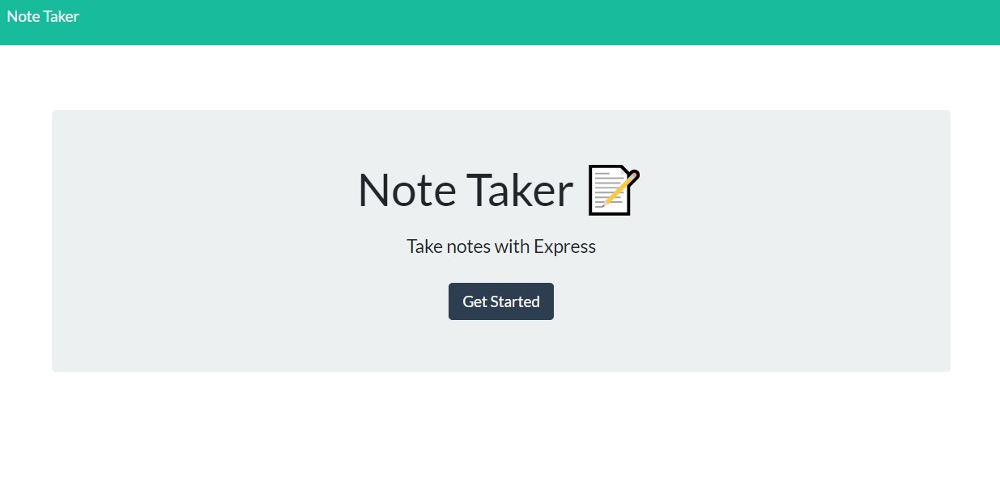

# NOTE TAKER

## 1. Description
This application allows the user to create many new notes and save them using Express.js back end. The user can then go back at another time and retrieve the saved note from the JSON file.

DEPLOYMENT:
 [DIRECT LINK](https://note-taker-cbushehry.herokuapp.com/) | [GITHUB REPOSITORY](https://github.com/cbushehry/note-taker)

## 2. Features
 * Every note has a title and description
 * User can create multiple new notes and save them for later
 * User can delete notes when they no longer need them

 

## 3. Tech Stack
 * HTML / CSS / JavaScript
 * NPM
 * Node.js
 * Express.js
 * Inquirer.js
 * uuid
 * Bootstrap / Google Fonts

## 4. Credits / Contact
This application was made by Cameron Bushehry

Contact Me: c.bushehry@gmail.com
