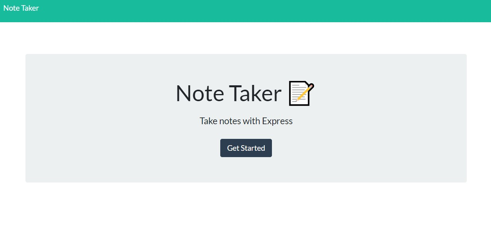

# Note Taker

A full-stack note-taking app with an Express.js backend. Notes are persisted to a JSON file on the server and survive restarts.

[GitHub Repository](https://github.com/cbushehry/note-taker)



## Features

- Create notes with a title and body
- Save notes for later retrieval
- Delete notes you no longer need

## Tech Stack

- Node.js / Express.js
- HTML / CSS / JavaScript
- Bootstrap 5 (Bootswatch Flatly theme)
- Font Awesome 5

## Getting Started

```bash
npm install
npm start
```

Open `http://localhost:3001` in your browser.

## API

| Method | Route | Description |
|--------|-------|-------------|
| GET | `/api/notes` | Returns all saved notes |
| POST | `/api/notes` | Creates and saves a new note |
| DELETE | `/api/notes/:id` | Deletes a note by ID |

## Contact

Cameron Bushehry — c.bushehry@gmail.com
